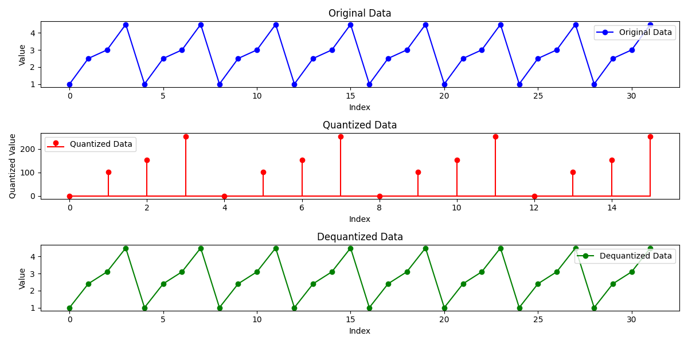

# Bit Quantization Project
This project demonstrates the process of bit quantization with 4-bit support.

# Description
Bit quantization is a technique used to reduce the memory footprint of data by representing it with fewer bits. This project focuses on 4-bit quantization with dynamic range adjustment, converting floating-point data to 4-bit integers and back.

# Visualization
The image below shows the original data, the quantized data, and the dequantized data with a simple error margin:

